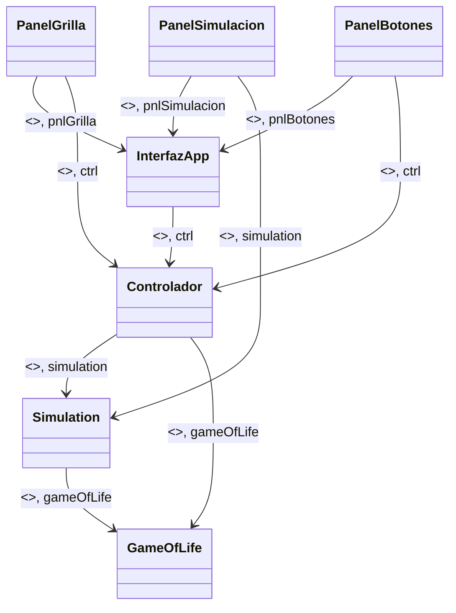

# Conway's Game of Life - Stand Alone


## Overview

Conway's Game of Life is a cellular automaton created by British mathematician John Horton Conway in the 1970s.  
This project is a Stand Alone Java application that simulates the evolution of cells on a grid following simple rules:

- A dead cell with exactly 3 live neighbors becomes alive (birth).  
- A live cell with 2 or 3 live neighbors stays alive; otherwise, it dies (due to loneliness or overpopulation).  

The simulation visualizes how patterns evolve, stabilize, spread, or die out over generations.

---

## Features

- Interactive grid where users can toggle cells on or off before starting.  
- Start and Stop buttons to control the simulation.  
- Displays the current generation number and number of alive cells.  
- Real-time simulation updates according to Conway’s rules.  

---

## Technologies

- **Language:** Java  
- **GUI:** Swing  
- **Concepts Covered:** Threads, OOP, Inheritance, Interfaces, Unit Testing, GRASP Design Patterns  

---

## Class Diagram

The project is structured into three main components:

**Interface:** `PanelSimulation`, `PanelGrid`, `InterfaceApp`, `PanelButtons`  
**Controller:** `Controller`  
**World:** `Simulation`, `GameOfLife`  

Relationships between components are managed with proper OOP principles to ensure modularity and maintainability.

---

## Usage

1. Clone the repository:  
git clone https://github.com/AndresContreras1034/Juego-De-Vida.git

2. Open the project in your favorite Java IDE (e.g., IntelliJ, Eclipse).

3. Run InterfaceApp.java to start the game.

4. Click on the grid to set the initial population and press **Start** to run the simulation.
"""```


## UML Diagram (Mermaid)



